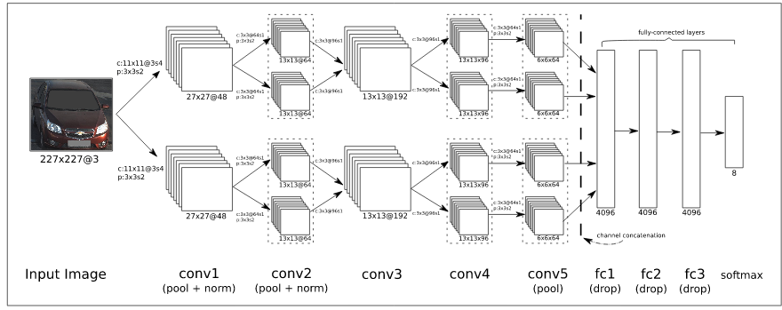

# ConVModel_Color_Distinction

## Model

Implementation of (simplified) model from the paper Rachmadi, Reza Fuad, and I. Purnama. "Vehicle color recognition using convolutional neural network." arXiv preprint arXiv:1510.07391 (2015), see cnn_col_seg.py. 
The model can be used to distinguish objects with respect to their color. The present model still consist of the 2 pathes which show good results for color classification but is missing some layers.

